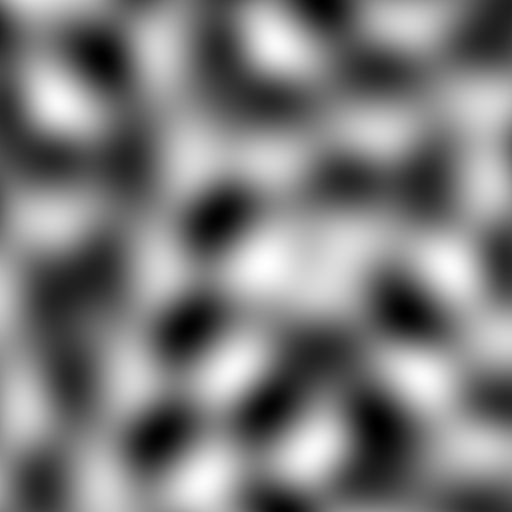

# Simplex 2D / 3D in Rust


[](https://crates.io/crates/simplex-23d-rs)

Provides basic 2D and 3D simplex noise functions.

* https://en.wikipedia.org/wiki/Simplex_noise

This Rust version is ported from the public domain Java implementation described here:

> Simplex noise demystified
> Stefan Gustavson, Linköping University, Sweden (stegu@itn.liu.se), 2005-03-22

* https://github.com/stegu/perlin-noise/blob/master/simplexnoise.pdf

* https://web.archive.org/web/20210506195658/http://weber.itn.liu.se/~stegu/simplexnoise/SimplexNoise.java

## Usage

```rust
use simplex_23d::Simplex;

let seed: u64 = 42;
let noise = Simplex::new(seed);

// 2d noise
let value: f32 = noise.sample2d(1.0, 1.0);

// 3d noise
let value: f32 = noise.sample3d(1.0, 1.0, 1.0);
```

The `Simplex` object generates a permutation table using the `rand` crate from the given seed value. For frequency, you'd just multiply it with the input coordinate:

```rust
let freq: f32 = 0.001234;
let x: f32 = 1.0 * freq;
let y: f32 = 1.0 * freq;
let value: f32 = noise.sample2d(x, y);
```

## Visualizations




## Changelog

* `0.2.1` fix perm_mod12 optimization
* `0.2.0` updated readme
* `0.1.0` initial release
